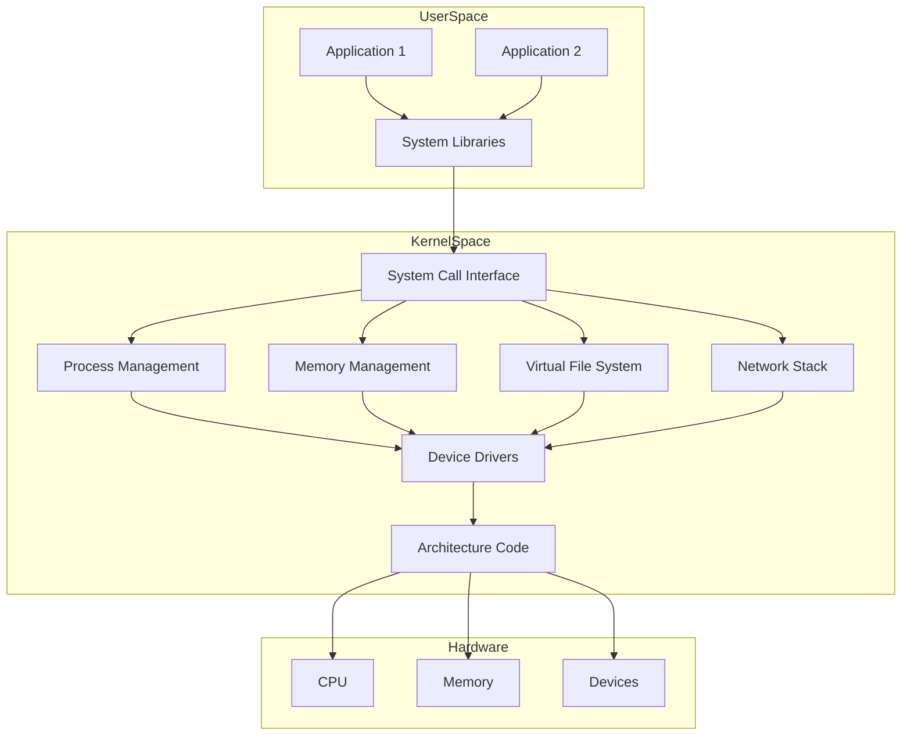
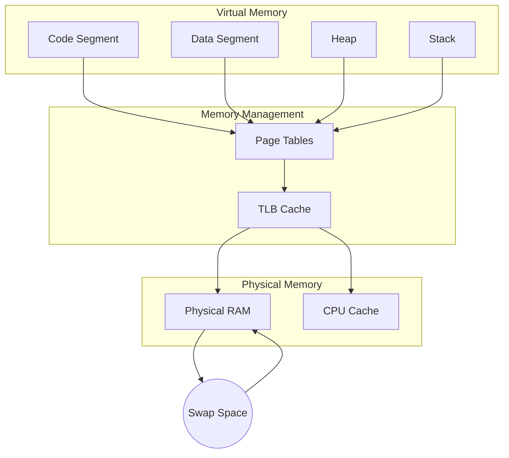
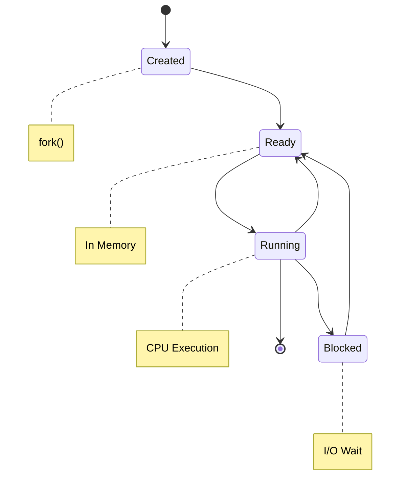
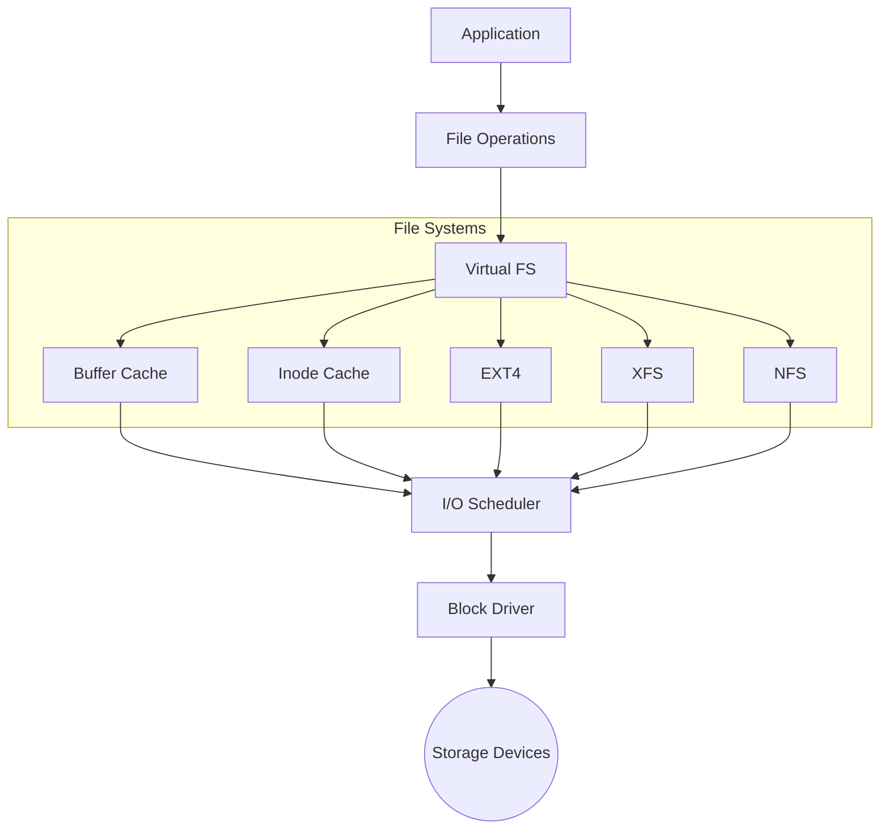
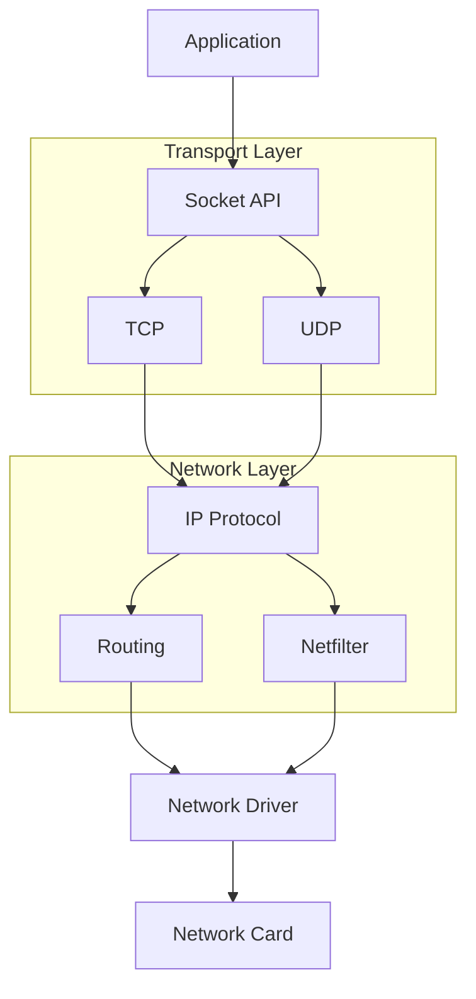
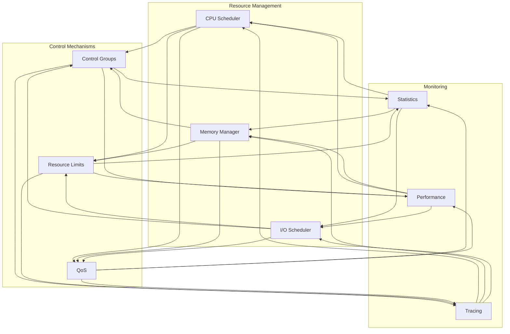

# Module 13: Linux OS and Kernel Internals

This module covers fundamental concepts of Linux operating system internals, kernel operations, and essential system administration commands. Each concept is explained in detail to help you understand how Linux works under the hood.

## Topics Covered

### Kernel Basics
The kernel is the core of the operating system that manages hardware resources and provides essential services to applications.



- **Kernel Architecture**: The Linux kernel uses a monolithic architecture where all core functions (process management, memory management, file systems, device drivers) run in kernel space. It's modular, allowing components to be loaded/unloaded at runtime.

- **System Calls**: These are the interface between user applications and kernel services. When an application needs to perform privileged operations (like reading a file or creating a process), it makes a system call. Common system calls include:
  - `read()/write()`: File operations
  - `fork()/exec()`: Process creation
  - `mmap()`: Memory mapping
  - `socket()`: Network operations

- **Module Management**: Linux can dynamically load/unload kernel modules (drivers, file systems) without rebooting. Key commands:
  - `lsmod`: List loaded modules
  - `modprobe`: Load a module
  - `rmmod`: Remove a module

- **Boot Process**: The sequence from power-on to user space:
  1. BIOS/UEFI initialization
  2. Bootloader (GRUB) loads kernel
  3. Kernel initialization
  4. Init system (systemd) starts user space

- **Device Drivers**: Software that allows the kernel to communicate with hardware devices. Types include:
  - Character devices (keyboards, serial ports)
  - Block devices (disks, SSDs)
  - Network devices (network cards)

- **Interrupt Handling**: How the kernel responds to hardware and software events:
  - Hardware interrupts (device signals)
  - Software interrupts (system calls)
  - Interrupt handlers (ISRs)

### Memory Management
How the kernel manages system memory and provides memory isolation between processes.



- **Virtual Memory**: Provides each process with its own address space, separated from physical memory:
  - Process sees continuous memory space
  - Physical memory can be fragmented
  - Enables memory protection between processes

- **Page Tables**: Data structures that map virtual addresses to physical addresses:
  - Multiple levels of translation
  - TLB (Translation Lookaside Buffer) for caching
  - Page faults handle missing mappings

- **Swap Space**: Extended memory using disk space:
  - Allows running more processes than physical RAM
  - Moves least-used pages to disk
  - Managed by the kernel swapper

- **Memory Mapping**: Associates file contents with process memory:
  - Efficient file I/O
  - Shared libraries
  - Inter-process communication

- **OOM Killer**: Out Of Memory Killer protects system stability:
  - Activates when memory is critically low
  - Selects processes to terminate
  - Based on badness score algorithm

- **Memory Pressure**: System state when memory resources are constrained:
  - Triggers various reclaim mechanisms
  - Affects system performance
  - Monitored via pressure stall information (PSI)

### Process Management
How the kernel manages and schedules running programs.



- **Process Scheduling**: Determines which process runs on CPU:
  - Completely Fair Scheduler (CFS)
  - Real-time schedulers
  - Load balancing across CPUs

- **Context Switching**: Switching between processes:
  - Save current process state
  - Load new process state
  - Manage CPU registers and memory maps

- **Priority Management**: Process execution priority:
  - Nice values (-20 to 19)
  - Real-time priorities
  - Dynamic priority adjustment

- **CPU Affinity**: Binding processes to specific CPUs:
  - Improves cache utilization
  - Better NUMA performance
  - Load distribution control

- **Cgroups**: Control groups for resource management:
  - CPU time limits
  - Memory limits
  - I/O bandwidth control
  - Hierarchical organization

- **Namespaces**: Process isolation features:
  - PID namespace (process IDs)
  - Network namespace (network stack)
  - Mount namespace (filesystems)
  - User namespace (user IDs)

### File System
How the kernel manages files and storage.



- **VFS (Virtual File System)**: Abstract layer for different filesystems:
  - Common interface for all filesystems
  - Supports local and network filesystems
  - Handles file operations uniformly

- **Inodes and Dentries**: Core filesystem structures:
  - Inodes: File metadata (permissions, size)
  - Dentries: Directory entries and hierarchy
  - Cache for performance

- **File System Types**: Different filesystem implementations:
  - ext4: Standard Linux filesystem
  - XFS: High-performance filesystem
  - Btrfs: Modern copy-on-write filesystem
  - Network filesystems (NFS, SMB)

- **Mount Points**: Filesystem attachment points:
  - Hierarchical structure
  - Mount options and flags
  - Bind mounts and overlays

- **Block I/O**: Disk operation management:
  - I/O schedulers
  - Read-ahead
  - Write-back caching

- **Buffer Cache**: Memory cache for disk blocks:
  - Reduces disk access
  - Write combining
  - Dirty page writeback

### Network Stack
How the kernel handles network communications.



- **Protocol Layers**: Implementation of network protocols:
  - Physical and Data Link (drivers)
  - Network (IP)
  - Transport (TCP/UDP)
  - Socket layer

- **Socket Interface**: Network programming API:
  - Stream sockets (TCP)
  - Datagram sockets (UDP)
  - Raw sockets
  - Unix domain sockets

- **Network Devices**: Network interface management:
  - Device drivers
  - Interface configuration
  - Traffic queuing

- **Routing**: Network packet routing:
  - Routing tables
  - Policy routing
  - Multipath routing

- **Packet Filtering**: Network security:
  - Netfilter framework
  - iptables/nftables rules
  - Connection tracking

- **Network Namespaces**: Network stack isolation:
  - Virtual networks
  - Container networking
  - Network virtualization

### System Resources
How the kernel manages and allocates system resources.



- **CPU Management**: Processor resource control:
  - Frequency scaling
  - Power management
  - Core isolation

- **Memory Allocation**: Memory resource management:
  - Slab allocator
  - Huge pages
  - Memory compaction

- **I/O Scheduling**: Disk access optimization:
  - CFQ (Completely Fair Queuing)
  - Deadline scheduler
  - BFQ (Budget Fair Queuing)

- **Resource Limits**: Process resource constraints:
  - ulimit settings
  - cgroup limits
  - System-wide limits

- **System Calls**: Kernel service interface:
  - System call table
  - System call overhead
  - System call filtering

- **Performance Tuning**: System optimization:
  - Kernel parameters
  - Sysctl settings
  - Performance monitoring

## Best Practices

### System Security
- **Principle of Least Privilege**
  - Use non-root users whenever possible
  - Configure sudo access with specific permissions
  - Implement role-based access control (RBAC)

- **File System Security**
  - Set appropriate file permissions (chmod, chown)
  - Use ACLs for fine-grained access control
  - Regularly audit file permissions with `find` and `stat`

- **Network Security**
  - Configure firewall rules using iptables/nftables
  - Use SSH key authentication instead of passwords
  - Regularly monitor network connections with `netstat`/`ss`

### Performance Optimization
- **Memory Management**
  - Monitor memory usage with `free`, `vmstat`
  - Configure swap space appropriately
  - Use huge pages for large memory applications

- **CPU Optimization**
  - Set appropriate process priorities with `nice`
  - Use CPU affinity for critical processes
  - Monitor CPU usage patterns with `top`/`htop`

- **I/O Performance**
  - Use appropriate I/O schedulers
  - Monitor I/O patterns with `iostat`
  - Implement disk quotas where needed

### System Monitoring
- **Resource Monitoring**
  - Set up monitoring tools (Nagios, Prometheus)
  - Configure alerting thresholds
  - Maintain historical performance data

- **Log Management**
  - Centralize logs with rsyslog/journald
  - Implement log rotation
  - Use log analysis tools (ELK stack)

### Backup and Recovery
- **Backup Strategy**
  - Regular system backups
  - Configuration file backups
  - Test restore procedures

## Common Use Cases

### System Administration

1. **Performance Troubleshooting**
   ```bash
   # CPU usage analysis
   top -b -n 1
   
   # Memory usage
   free -m
   vmstat 1 10
   
   # Disk I/O
   iostat -xz 1 10
   
   # Network traffic
   iftop -P
   ```

2. **Security Hardening**
   ```bash
   # Find SUID/SGID files
   find / -type f \( -perm -4000 -o -perm -2000 \) -exec ls -l {} \;
   
   # Check for open ports
   ss -tuln
   
   # Monitor authentication attempts
   tail -f /var/log/auth.log
   ```

3. **Resource Management**
   ```bash
   # Set process priority
   renice -n 10 -p $PID
   
   # Set CPU affinity
   taskset -pc 0-2 $PID
   
   # Limit process resources
   ulimit -n 4096
   ```

### Kernel Operations

1. **Module Management**
   ```bash
   # List loaded modules
   lsmod
   
   # Load a module with parameters
   modprobe module_name parameter=value
   
   # Remove a module
   rmmod module_name
   ```

2. **System Tuning**
   ```bash
   # View kernel parameters
   sysctl -a
   
   # Modify kernel parameter
   sysctl -w vm.swappiness=60
   
   # Make changes permanent
   echo "vm.swappiness=60" >> /etc/sysctl.conf
   ```

3. **Debugging**
   ```bash
   # System call tracing
   strace command
   
   # Kernel message monitoring
   dmesg -w
   
   # Process debugging
   gdb -p $PID
   ```

### Network Operations

1. **Traffic Analysis**
   ```bash
   # Capture network traffic
   tcpdump -i eth0 -n
   
   # Monitor bandwidth
   iftop -i eth0
   
   # Connection tracking
   conntrack -L
   ```

2. **Firewall Management**
   ```bash
   # List firewall rules
   iptables -L -n -v
   
   # Add new rule
   iptables -A INPUT -p tcp --dport 80 -j ACCEPT
   
   # Save rules
   iptables-save > /etc/iptables/rules.v4
   ```

### File System Operations

1. **Storage Management**
   ```bash
   # Disk usage analysis
   du -sh /*
   
   # Find large files
   find / -type f -size +100M -exec ls -lh {} \;
   
   # Monitor file system events
   inotifywait -m /path/to/watch
   ```

2. **File System Maintenance**
   ```bash
   # Check file system
   fsck -f /dev/sda1
   
   # Monitor I/O operations
   iotop -o
   
   # Disk space monitoring
   df -h
   ```

## Key Commands and Tools
- `uname`: System and kernel information
- `lsmod`: List kernel modules
- `sysctl`: Kernel parameters
- `dmesg`: Kernel messages
- `proc`: Process information
- `vmstat`: Virtual memory statistics
- `iostat`: I/O statistics
- `netstat`: Network statistics
- `strace`: System call tracing
- `perf`: Performance analysis
- `ftrace`: Function tracing
- `sar`: System activity reporter
- `lsof`: List open files
- `ss`: Socket statistics
- `ip`: Network configuration

## Examples in this Module

1. `01_kernel_info.sh`: Kernel information and management
   - Kernel version and information
   - Module management
   - System calls
   - Boot parameters
   - Hardware information

2. `02_memory_analysis.sh`: Memory management tools
   - Memory statistics
   - Swap usage
   - Page cache
   - Memory mapping
   - OOM monitoring

3. `03_process_inspection.sh`: Process internals
   - Process states
   - Scheduling information
   - Resource usage
   - Context switches
   - Priority management

4. `04_filesystem_tools.sh`: File system operations
   - File system information
   - Inode management
   - Mount operations
   - Disk I/O analysis
   - File system debugging

5. `05_network_inspection.sh`: Network stack analysis
   - Protocol statistics
   - Socket information
   - Network interfaces
   - Routing tables
   - Packet analysis

6. `06_resource_monitoring.sh`: System resource tools
   - Performance monitoring
   - Resource usage
   - System limits
   - Bottleneck analysis
   - Tuning parameters

7. `07_kernel_tracing.sh`: Kernel tracing and debugging
   - System tracing
   - Event monitoring
   - Performance profiling
   - Debug information
   - Error analysis


## Further Reading

### Kernel Basics
- [Linux Kernel Documentation](https://www.kernel.org/doc/html/latest/) - Official Linux kernel documentation
- [Linux Kernel Development (Book)](https://www.amazon.com/Linux-Kernel-Development-Robert-Love/dp/0672329468) - Comprehensive guide by Robert Love
- [Linux Kernel Teaching](https://linux-kernel-labs.github.io/refs/heads/master/) - Educational resources for kernel development
- [The Linux Programming Interface](https://man7.org/tlpi/) - Comprehensive guide to Linux/UNIX system programming

### Memory Management
- [Understanding the Linux Virtual Memory Manager](https://www.kernel.org/doc/gorman/) - Detailed explanation of VM subsystem
- [Linux Memory Management Documentation](https://www.kernel.org/doc/html/latest/admin-guide/mm/) - Official memory management docs
- [Linux Page Cache](https://www.thomas-krenn.com/en/wiki/Linux_Page_Cache_Basics) - Detailed explanation of page cache
- [OOM Killer Documentation](https://www.kernel.org/doc/html/latest/admin-guide/mm/oom_killer.html) - Understanding the OOM killer

### Process Management
- [Linux Process Management](https://www.kernel.org/doc/html/latest/admin-guide/pm/) - Official process management docs
- [Linux Scheduler Documentation](https://www.kernel.org/doc/html/latest/scheduler/) - Detailed scheduler information
- [Control Groups Documentation](https://www.kernel.org/doc/html/latest/admin-guide/cgroup-v2.html) - Understanding cgroups v2
- [Linux Namespaces](https://lwn.net/Articles/531114/) - Deep dive into Linux namespaces

### File System
- [Linux Filesystem Documentation](https://www.kernel.org/doc/html/latest/filesystems/) - Official filesystem docs
- [Linux VFS Documentation](https://www.kernel.org/doc/html/latest/filesystems/vfs.html) - Virtual File System details
- [ext4 Documentation](https://www.kernel.org/doc/html/latest/filesystems/ext4/) - Comprehensive ext4 filesystem guide
- [Linux Storage Stack Diagram](https://www.thomas-krenn.com/en/wiki/Linux_Storage_Stack_Diagram) - Visual guide to storage stack

### Network Stack
- [Linux Networking Documentation](https://www.kernel.org/doc/html/latest/networking/) - Official networking docs
- [Linux Network Stack](https://wiki.linuxfoundation.org/networking/start) - Linux Foundation networking guide
- [Netfilter Documentation](https://www.netfilter.org/documentation/) - Deep dive into packet filtering
- [Linux Advanced Routing](https://lartc.org/) - Advanced routing & traffic control

### System Resources
- [Linux Performance](http://www.brendangregg.com/linuxperf.html) - Brendan Gregg's Linux performance resources
- [Linux Performance Analysis Tools](http://techblog.netflix.com/2015/11/linux-performance-analysis-in-60s.html) - Netflix's guide to performance analysis
- [Linux System Monitoring](https://www.kernel.org/doc/html/latest/admin-guide/monitoring/) - Official monitoring documentation
- [Linux Tracing Technologies](https://www.kernel.org/doc/html/latest/trace/) - Kernel tracing documentation

### Additional Resources
- [Linux Kernel Map](https://makelinux.github.io/kernel/map/) - Interactive map of Linux kernel
- [Linux Kernel Newbies](https://kernelnewbies.org/) - Resources for kernel beginners
- [LWN.net](https://lwn.net/) - Linux Weekly News, excellent technical articles
- [Linux Performance Tools](http://www.brendangregg.com/Perf/linux_perf_tools_full.png) - Complete performance tools map
